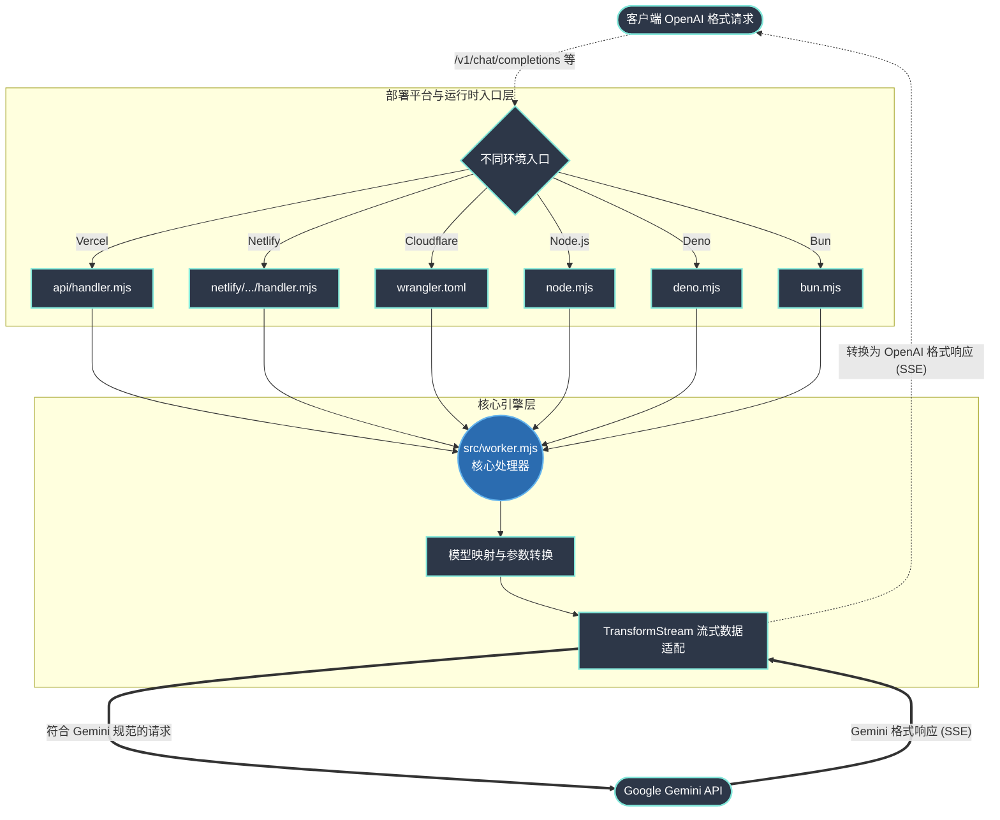

# openai-gemini 项目结构与逻辑分析

该项目是一个高度可移植的 API 代理层，主要用于将符合 OpenAI 接口规范的请求（如 `/v1/chat/completions`、`/v1/embeddings`、`/v1/models`）转换为 Google Gemini API 的格式，并将 Gemini 的响应（包括流式 SSE）转换回 OpenAI 的标准格式返回。项目被设计为可以在多种 Serverless 平台和 JavaScript 运行时中无缝部署。

以下是项目根目录及各子目录文件的详细作用与逻辑分析：

## 1. 核心业务逻辑
- **`src/`**
  - **`worker.mjs`**：项目的核心业务逻辑实现文件。
    - **作用**：提供统一的 `fetch` 处理函数，作为所有平台和运行时的处理引擎。
    - **逻辑**：
      - 拦截 `/chat/completions`、`/embeddings`、`/models` 等路由请求。
      - 提取请求头中的 API Key，校验请求方法。
      - **模型映射与参数转换**：将请求中的 `model` 字段（如 `gemini-flash-latest`、`gemma-*` 等）转换为 Gemini 的调用格式。将 OpenAI 请求体中的参数（如安全设置、思考参数、函数调用、返回格式限制等）适配为 Gemini 的 `generationConfig` 和 `safetySettings`。
      - **流数据处理**：支持 SSE（Server-Sent Events）流式返回，通过 `TransformStream` 将 Gemini 的流式响应分块映射为 OpenAI 风格的流式响应。
      - **多模态支持**：实现了 `parseImg` 函数用于处理传入的 Base64 图片或图片 URL。

## 2. 运行时入口文件 (Runtimes)
为了实现极高的跨平台兼容性，项目针对不同的 JavaScript 运行时提供了专门的入口文件，它们统一调用了 `src/worker.mjs` 中的 `fetch` 处理引擎：
- **`node.mjs`**：Node.js 运行时入口。借助 `@whatwg-node/server` 提供的 `createServerAdapter`，将 Web 标准的 Fetch API 适配到 Node.js 的原生 HTTP 服务器（`node:http`）上。
- **`deno.mjs`**：Deno 运行时入口。直接调用原生的 `Deno.serve` 启动 HTTP 服务器并处理请求。
- **`bun.mjs`**：Bun 运行时入口。直接调用 `Bun.serve` 启动 HTTP 服务器。

## 3. Serverless 平台部署入口与配置
项目支持在多种主流的 Serverless 云平台上一键部署，各平台的路由适配和配置文件如下：

### Vercel
- **`api/handler.mjs`**：Vercel Edge Functions 入口文件。导出了 `worker.fetch`，配置了 `runtime: "edge"`，并显式指定了 Google AI Studio / Gemini API 可用的边缘部署区域（regions）。
- **`vercel.json`**：Vercel 部署配置文件。配置了 `rewrites` 规则，将所有客户端发往项目根路径的请求 (`/(.*)`) 全部转发到 `api/handler` 处理。

### Netlify
- **`netlify/functions/handler.mjs`**：Netlify Serverless Functions 的入口文件，处理 `/*` 路径下的请求。
- **`netlify/edge-functions/handler.mjs`**：Netlify Edge Functions 的入口文件，处理 `/edge/*` 路径下的请求。
- **`netlify.toml`**：Netlify 部署配置文件。指定了静态文件发布目录为 `public/`，并配置了 Node Functions 的打包工具为 `esbuild`。

### Cloudflare Workers
- **`wrangler.toml`**：Cloudflare Workers 的配置文件。指定了项目的主入口文件为 `src/worker.mjs`，并开启了 `nodejs_compat` 兼容标志，以支持 worker 内部对 Node.js 核心模块（如 `node:buffer`）的使用。

## 4. 其他配置与静态资源文件
- **`package.json`**：Node.js 项目配置文件。
  - **依赖管理**：包含适配层核心依赖 `@whatwg-node/server`。
  - **脚本配置**：定义了多种运行时的启动和调试命令（如 `start`、`dev`、`start:deno`、`start:bun` 等），方便本地开发和测试。
- **`public/empty.html`**：一个空的 HTML 文件，主要用于满足 Netlify 等托管平台对静态资源目录 `public/` 必须存在的发布和构建要求。

## 项目结构与逻辑分析

